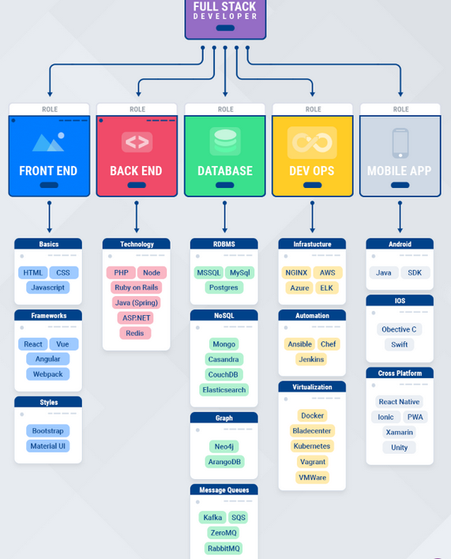

# ProgressiveLearning_workbook
Repo made in love for the learning of progressive, ever-evolving full stack technologies.

 

### Trying to find the serene "get-away" in exploration.

  

 

## Full Stack development

<!--  -->

 

 > Pick one topic and start exploring with hands on projects.
*** 
List of skills to take up!

 

> TODOs

- [ ] Front End
    - [ ] HTML, JS/ jQuery basics ES6, CSS - Website Basics
    - [ ] Frameworks
        - [ ] React
        - [ ] Vue
        - [ ] Angular
        - [ ] Webpack
        - [ ] Babel
        - [ ] GraphQL
        - [ ] Production frameworks (Next.js, Nuxt.js)
    - [ ] Django web development & deployment

- [ ] Backend
    - [ ] JAVA (Spring & Hibernate), Node
    - [ ] Web services (REST framework, REST APIs)
    - [ ] Microservices, Python services (Flask, gunicorn)

- [ ] Database
    - [ ] RDBMS - MySql, Postgres
    - [ ] NoSQL - Mongo, Cassandra, CouchDB, ElasticSearch
    - [ ] Message Queues - Kafka, RabbitMQ

- [ ] DevOps
    - [ ] Nginx
    - [ ] AWS
    - [ ] Azure
    - [ ] Jenkins
    - [ ] Docker
    - [ ] Kubernetes

- [ ] Mobile (optional)
    - [ ] Andriod
    - [ ] React Native
    - [ ] Ionic
    - [ ] PWA
    - [ ] Native Script
    - [ ] Electron js (optional - Desktop Application)
 
 ----
## Additional
 - [ ] Automation (Automating stuff using python)
 - [ ] Plugins & Graphs for Visualization
 - [ ] Exploring visualization tools in different languages
 - [ ] Networking knowledge
 - [ ] Linux & Cross platform functionalities

 -----

 ## All rounders ( Brush Up )
 - [ ] JAVA / JS Design patterns
 - [ ] Algorithms & Data Structures
 - [ ] Solid Principles
 - [ ] Clean coding
 